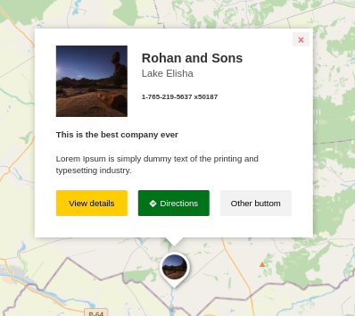

# NgLeafletUniversal

NgLeafletUniversal is an open source Angular module that extends and simplifies the Leaflet implementation for Angular.

## Server side rendering (SSR) support

One of the principals problems when you are using Leaflet's maps in your Angular application is the configuration for SSR.
This library contains all the required configuration for been integrated with your Angular Universal application.

## Installation

You can install this library via npm using the next command on your project

    npm i ng-leaflet-universal

## Implementation

After installing, import the module in your application:

```typescript
import { NgLeafletUniversalModule } from "ng-leaflet-universal";
```

```typescript
imports: [
	...
	NgLeafletUniversalModule
],
```

Add the leaflet css to your angular.json:

```json
"styles": [
	"./node_modules/leaflet/dist/leaflet.css",
	"src/styles.css"
],
```

Basic template implementation:

```html
<div class="map-wrapper">
  <ng-leaflet-universal></ng-leaflet-universal>
</div>
```

It's up to you adding this styles.

```css
.map-wrapper {
  position: relative;
  width: 300px;
  height: 300px;
}
```

Add marker to your map using the _updateMarkers_ function in your own component

```typescript
import { AfterViewInit, Component, ViewChild } from  '@angular/core';
import { MapComponent } from 'ng-leaflet-universal';
import { Marker } from 'ng-leaflet-universal/lib/models/marker.interface';

@Component({
	selector:  'app-custom-component',
	templateUrl:  './custom-component.component.html',
	styleUrls: ['./custom-component.component.scss'],
})
export  class  CustomComponentComponent  implements AfterViewInit {
@ViewChild(MapComponent) mapComponent: MapComponent;
markers: Marker[];

constructor() {
	this.markers = [];
}

ngAfterViewInit(): void {
	this.mapComponent.updateMarkers(this.markers);
}
```

Once you set or update your marker list using the _updateMarkers_ function, the map will set the view on the center of your markers collection automatically.

## Elements / components

### Markers

We provide you an marker component that you can use for setting your locations easily, setting the location point (Latitude and Longitude) and the icon you would like to show into it.


**Model:**
Key | Type | Definition
-|--|--
icon |string |Url of icon or image you want to show in your marker.
location | Location: { latitude: string, longitude: string } | The specific location where your marker will be showed.
card |MarkerCard | The card that will be open when a user click on your marker.

**Example**:

```javascript
myMarker: Marker = {
  id: "abc123",
  icon: "https://picsum.photos/200/200",
  location: {
    latitude: -81.1288,
    longitude: -81.4579,
  },
  card: myMarkerCard,
};
```

### Marker Cards

This library contains a card component that you can customize and adapt to your own needs. These cards will be open when you click in your markers. Every single element in this cards includes several parameters that allows you customize that element's style, and a class param that you can use for setting your own css class.



**Model**:
| Key | Type | Definition
|--|--|--
|image | CardImage | Specify the main image of the card
|title | CardText | Show a title into the card
|subtitle | CardText | Show a subtitle into the card
|address |CardText | Show the address of the lacation
|content |CardText | An html that will be rendered into the card
|cardStyle | CardStyle | An object that define (By params) the way your card will look
|callToActions | CardCallToAction[] | A collection that indicate the buttons will be shown in the card
|customStyleClass |string | A css class that allows you to set your own style rules for your cards
|customHtml |string | A custom html string that you can use to replace the default card structure and define everything you want in the card

**Example**:

```javascript
    card: {
	    image: { url:  'https://picsum.photos/200/200' },
	    title: { text:  'The place', customStyleClass:  'awesome-title' },
	    subtitle: { text:  'The best place' },
	    content: { text: '<p> This is the content that will be used in the <b> card </b> </p>' },
	    address: { text:  'Neverland, NM 88203' },
	    callToActions: [
		    {
			    text:  'View details',
			    link:  'https://myawesomeapp.domain/Location-1',
			    customStyleClass:  'my-details-button'
		    },
		    {
			    text:  'Directions',
			    backgroundColor:  '#007319',
			    textColor:  '#fff',
			    link:  `https://www.google.com/maps/@-81.1288,-81.4579,18.13z`,
			    icon: 'fas fa-directions'
		    }
	    ],
	    customStyleClass: 'custom-card-style'
    }
```

## Contribuitors

- [Christian De La Cruz](https://github.com/DevCriss)
- [Rafael A. Reyes](https://github.com/rareyesrd)
- [Niurmiguel Gonzalez](https://github.com/Niurmiguel)
